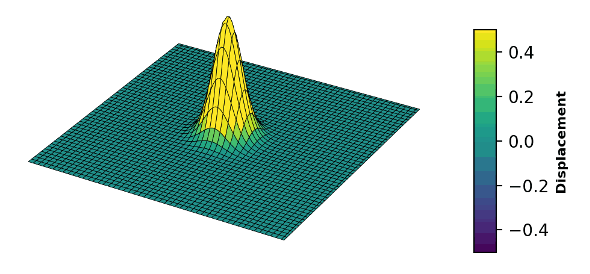
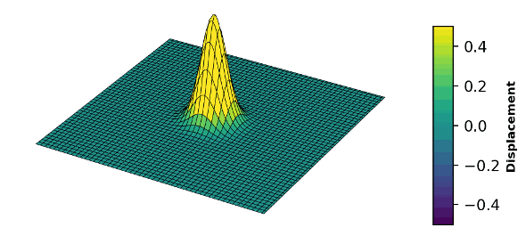
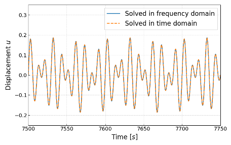
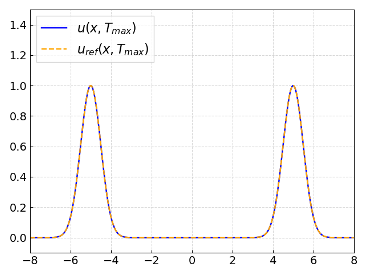

# Scalar Wave Equation Simulation

Modeling the scalar wave equation in both time and frequency domains — Software Lab, 2024.

## 🌀 Overview

Wave simulation is widely used across many engineering fields such as biomedical applications and non-destructive testing. This project explores two computational methods to model wave propagation:

- **Finite Difference Method (FDM)** – Introduced first to model basic wave behavior.
- **Finite Element Method (FEM)** – Applied subsequently for more complex geometries and boundary conditions.

The simulation considers a **1D isotropic and homogeneous** material domain.

> All code and related documentation developed as part of this group project can be found in this repository.

## 🛠️ Technologies Used

- Python (NumPy, Matplotlib, scipy)
- Finite Difference Method (FDM)
- Finite Element Method (FEM)
- Object-Oriented Programming (System, Node, etc.)

## 📁 Project Structure

scalar-wave-equation/
├── fdm/ # Finite Difference Method implementation
├── fem/ # Finite Element Method implementation
├── docs/ # Project documentation and reports
├── images/ # Visualizations, graphs, and wave plots
└── README.md

## 👥 Team Members

- Tolga Gökalp  
- Fatemeh Seyfi  
- Laura Winter  
- Julius Weidinger  

## 👩‍🏫 Supervisor

- Divya Singh

## 🖼️ Sample Visuals

You can include some example output visuals here, e.g.:

